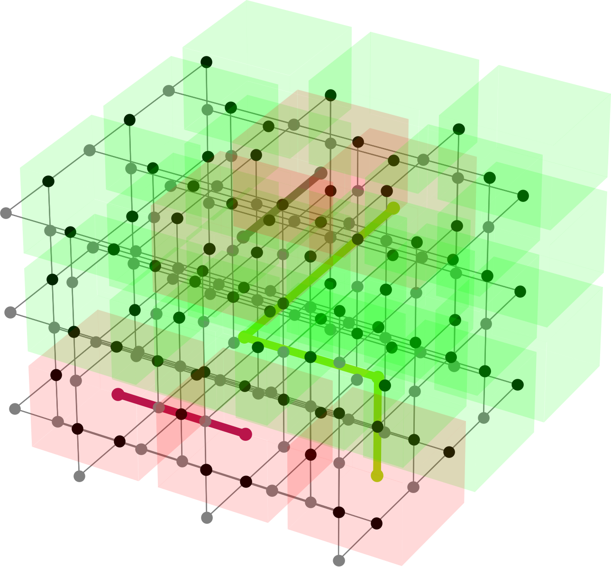

FlamingPy Documentation
=======================

.. rst-class:: lead grey-text ml-2

:Release: |release|

.. raw:: html

    

    

       

            

                </img>
            

            

                

                    FlamingPy (FP) is a cross-platform Python library with a variety of backends
                    for efficient simulations of error correction in fault-tolerant quantum computers.
                

            

        

        

.. index-card::
    :name: Key Concepts
    :link: usage/getting_started.html
    :description: Learn how to simulate a fault-tolerant quantum computer

.. index-card::
    :name: Developing
    :link: development/contribution.html
    :description: How you can contribute to the FlamingPy project

.. index-card::
    :name: API
    :link: source/fp.html
    :description: Explore the FlamingPy API

.. raw:: html

        

    

Features
--------

* Simulates error correction on combinations of CV and DV codes to obtain estimations of fault-tolerant thresholds.
* Supports encoding qubits into GKP states (more precisely, combinations of GKP and squeezed states).
* Is conveniently modularized, allowing the user to insert custom noise models, codes, decoders, backends and other features.
* Provides a host of visualization tools for ease of verifying correctness.

Community
---------

You can start discussions and connect with our community members on our `Discussions Forum <https://discuss.pennylane.ai/c/flamingpy>`_.

Attribution for authors
-----------------------

FlamingPy is the work of `many contributors <https://github.com/XanaduAI/flamingpy/graphs/contributors>`__. If you are doing research using FlamingPy, please cite our paper below:

    Ilan Tzitrin, Takaya Matsuura, Rafael N. Alexander, Guillaume Dauphinais, J. Eli Bourassa, Krishna K. Sabapathy, Nicolas C. Menicucci, and Ish Dhand,
    Fault-Tolerant Quantum Computation with Static Linear Optics, PRX Quantum, Vol. 2, No. 4, 2021,
    |PRX_Quantum|

In addition to the authors above, the developers would like to thank Sanchit Bapat, Ashlesha Patil, Michael Vasmer, and Trevor Vincent for their contributions to the pre-release project.

License
-------

FlamingPy is **free** and **open source**, and released under the |Apache2|.

.. toctree::
   :maxdepth: 2
   :caption: Home
   :hidden:

   self
   install

.. toctree::
   :maxdepth: 2
   :caption: Background
   :hidden:

   quantum_error_correction

.. toctree::
   :maxdepth: 2
   :caption: Using FlamingPy
   :hidden:

   usage/getting_started
   usage/tutorials

.. toctree::
   :maxdepth: 2
   :caption: Development
   :hidden:

   development/guide_for_devs
   build_docs
   development/contribution

.. toctree::
   :maxdepth: 2
   :caption: Getting Help
   :hidden:

   faq
   help/support

.. toctree::
   :maxdepth: 2
   :caption: Python API
   :hidden:

   source/fp
   source/fp.codes
   source/fp.cv
   source/fp.decoders
   source/fp.noise
   source/fp.simulations
   source/fp.utils

.. |PRX_Quantum| raw:: html

   <a href="http://dx.doi.org/10.1103/PRXQuantum.2.040353" target="_blank">DOI:10.1103/prxquantum.2.040353</a>

.. |Apache2| raw:: html

   <a href="http://www.apache.org/licenses/LICENSE-2.0" target="_blank">Apache License, Version 2.0</a>