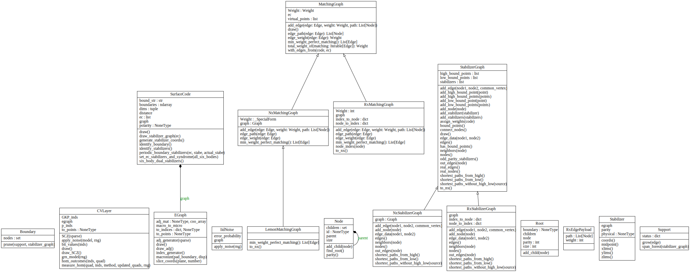
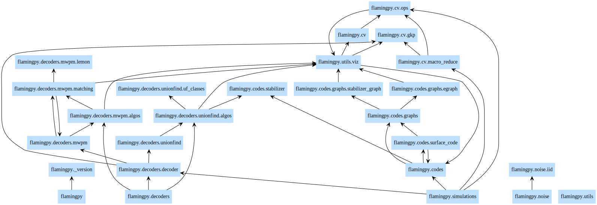

fp
==

In the following sections, we will detail the Python APIs for FlamingPy. 

``fp`` is the top level module from which all basic functions and classes of FlamingPy can be directly imported.

Available modules
-----------------

.. currentmodule:: flamingpy

.. autosummary::
    :toctree: api

    ~codes
    ~cv
    ~decoders
    ~simulations
    ~utils

Module members
--------------

.. currentmodule:: flamingpy

.. automodapi:: flamingpy
    :no-heading:
    :include-all-objects:

UML Diagrams
--------------

Classes
^^^^^^^^^^^^ 

|
Packages
^^^^^^^^^^^^

